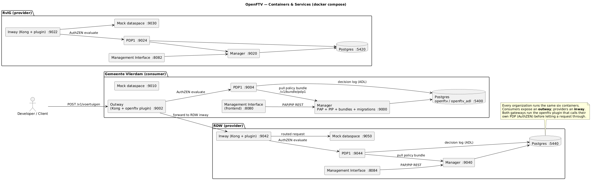
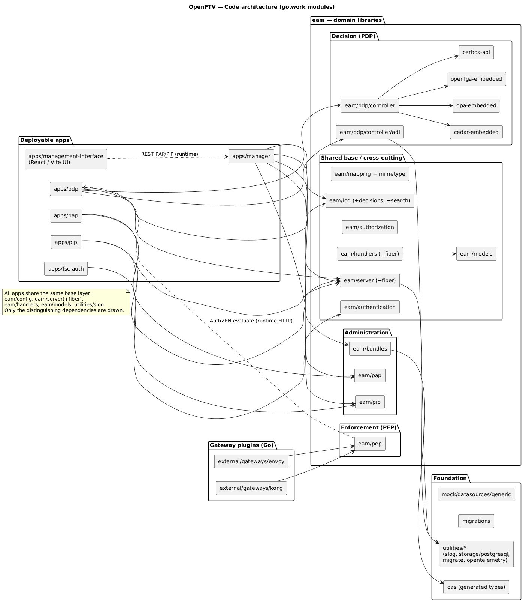
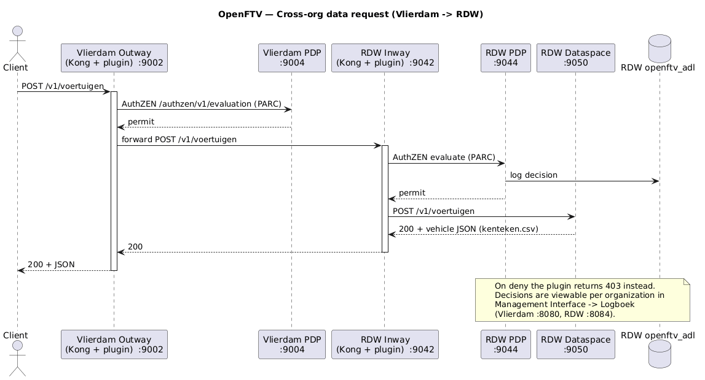

# Architecture diagrams

PlantUML source for the OpenFTV architecture. Three views:

| Source | Rendered | Shows |
| --- | --- | --- |
| [`containers.puml`](containers.puml) | [`openftv-containers.png`](openftv-containers.png) | Deployment view — the six containers per organization (frontend, manager, gateway, PDP, dataspace, Postgres), their ports, intra-org wiring, and the cross-org request path. |
| [`code.puml`](code.puml) | [`openftv-code.png`](openftv-code.png) | Code view — the components of the single Go module: deployable apps, gateway plugins, the `eam/*` domain libraries (PEP / PDP / administration / shared base), and the foundation layer. |
| [`request-sequence.puml`](request-sequence.puml) | [`openftv-request-sequence.png`](openftv-request-sequence.png) | A `Vlierdam → RDW` data request step by step, including both PDP evaluations and the decision log. |

## Containers & services



## Code architecture



## Cross-org request (Vlierdam → RDW)



## Rendering

Pick whichever is handy:

```shell
# PlantUML CLI (needs Java + plantuml.jar, or the `plantuml` package):
plantuml docs/architecture/*.puml            # -> PNG next to each .puml
plantuml -tsvg docs/architecture/*.puml      # -> SVG

# Docker, no local install:
docker run --rm -v "$PWD:/work" -w /work plantuml/plantuml docs/architecture/*.puml
```

- **VS Code:** install the *PlantUML* extension and press `Alt+D` to preview an open `.puml`.
- **Browser:** paste the file contents into <https://www.plantuml.com/plantuml>.

## Keeping them accurate

These are hand-authored from the codebase (compose services, Kong routes, and the
import graph). When you add a service to `docker/compose.yaml` or a new component
directory, update the matching `.puml` and regenerate the committed PNGs:

```shell
docker run --rm -v "$PWD:/work" -w /work plantuml/plantuml -tpng docs/architecture/*.puml
```
